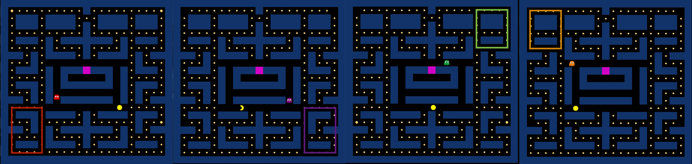
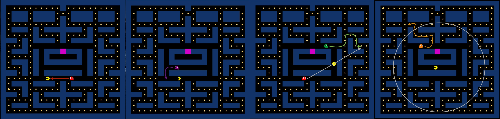

# Pacman

Pacman is a single player game, where the player has three chances to complete the level and win the game.  

## How to run the Java application (game)
1. 
2.
3.
4.
5.

## How to start the game

Once you have the application successfully running, you will be greeted with the game's main menu. From there, click on the option "Play Game" to start playing.

## How to play

### Player objective

As the player, your objective will be to control Pacman to eat all of the edibles spread throughout the maze and win the game. There is no time limit enforced.
However, there will be four ghosts who will try to chase Pacman within the maze. Unless the ghosts are in a "frightened" state, you will have to avoid collisions between Pacman and the ghosts. Such collisions will "kill" Pacman, and if he "dies" thrice, you will lose the game. 

### Controlling Pacman

You can use the following keys to control Pacman and move him within the maze:

1. W -> Move Up
2. S -> Move Down
3. A -> Move Left
4. D -> Move Right

## More about the ghosts

There are four ghosts in the game: "Red," "Orange," "Green," and "Purple." Each of them has unique sets of behaviors that will vary depending on their state and proximity to Pacman at any point in the game.

### Common elements of ghost behavior

Although ghosts can transition between seven states at any point in the game, players should be concerned about four main states. They are "AtHome," "Scattered," "Chasing," and "Frightened." At the beginning of the game, only Red will start in the Scattered state, whereas the remaining three ghosts will start in the AtHome state (where they will move side-to-side inside a small area in the middle of the maze, also called the "ghost home") and then transition to the Scattered state. From the Scattered state, all ghosts will have the following four waves of Scattered/Chasing alternations, unless Pacman consumes a "Capsule":

1. Stay in the Scattered state for 7 seconds, then transition to the Chasing State for 20 seconds.
2. Stay in the Scattered state for 7 seconds, then transition to the Chasing State for 20 seconds.
3. Stay in the Scattered state for 7 seconds, then transition to the Chasing State for 20 seconds.
4. Stay in the Scattered state for 7 seconds, then transition to the Chasing State permanently.

If Pacman consumes a Capsule, all four ghosts will immediately transition to the Frightened state for the next 8 seconds. If Pacman collides with the ghosts at this state, the ghosts will return to the ghost home. Whether the ghosts return to the ghost home or the 8 seconds run out without collisions with Pacman, ghosts will transition back to the last state they were in before the Frightened state. 

Below, we discuss the difference in ghost behavior in each state. We use "Tile" to refer to a 30\*30 pixel square on the screen. The total maze size is 22\*23 tiles. 

### Red

Red will stay in the AtHome state for 0 seconds (as Red does not start the game in this state.) 
In the Scattered state, Red will move towards the maze's bottom-left area. 
In the Chasing state, Red will directly chase Pacman by always moving towards the nearest tile to Pacman in the maze. 

### Purple

Purple will stay in the AtHome state for 1 second.
In the Scattered state, Purple will move towards the maze's bottom-right area. 
In the Chasing state, Purple will ambush Pacman by always moving towards the nearest tile, which is at a distance of two tile widths from Pacman's front. 

### Green

Green will stay in the AtHome state for 15 seconds. 
In the Scattered state, Green will move towards the maze's top-right area. 
In the Chasing state, Green will always move towards the nearest tile, which is at twice the distance between Pacman and Red.

### Orange

Orange will stay in the AtHome state for 10 seconds. 
In the Scattered state, Orange will move towards the maze's top-left area. 
In the Chasing state, Orange will first calculate the distance between him and Pacman. If this distance is more than eight tile widths, he will directly chase Pacman until the distance is reduced to less than eight tile widths, after which he will move back towards the maze's top-left area and repeat calculating the distance again. 

