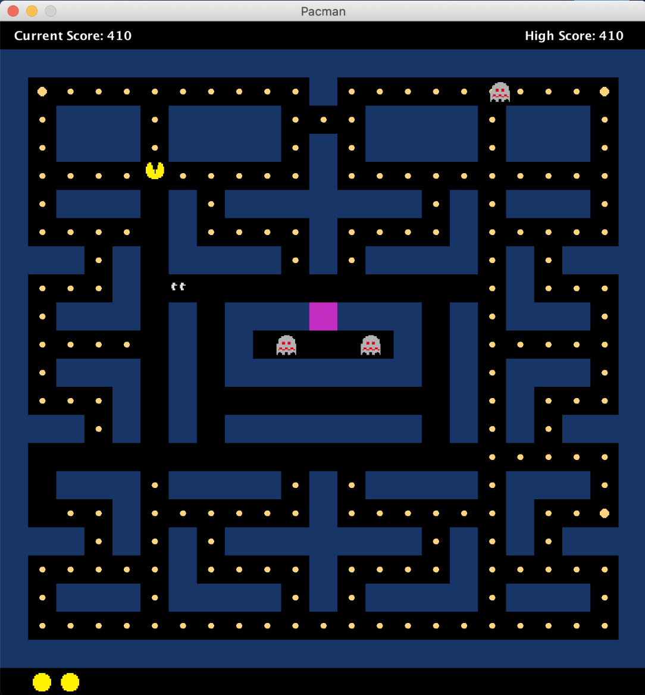

# Pacman

Pacman is a single player game, where the player has three chances to complete the level and win the game. 

## How to run the Java application (game)
1.
2.
3.
4.
5.

## How to start the game

Once you have the application successfully running, you will be greeted with the gane's main menu. From there, click on the option "Play Game" to start playing.

## How to play

### Player objective

As the player, your objective will be to control Pacman to eat all of the edibles spread throughout the maze and win the game. There is no time limit enforced.
However, there will be four ghosts who will try to chase Pacman within the maze. Unless the ghosts are in a "frightened" state, you will have to avoid collisions between Pacman and the ghosts. Such collisions will "kill" Pacman, and if he "dies" thrice, you will lose the game. 

### Controlling Pacman

You can use the following keys to control Pacman and move him within the maze:

1. W -> Move Up
2. S -> Move Down
3. A -> Move Left
4. D -> Move Right

## More about the ghosts

